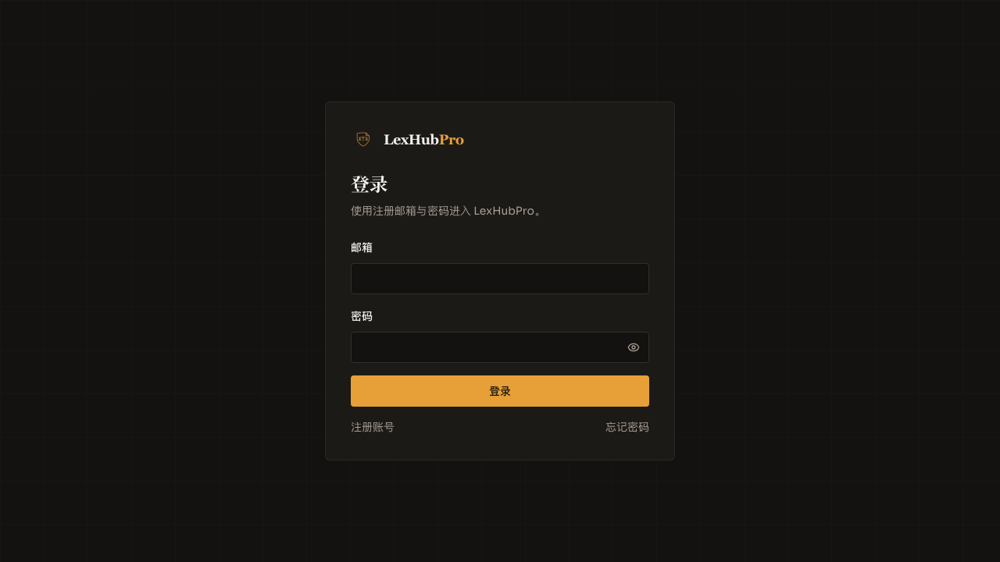

# LexHubPro

法律合同审查平台：用户注册登录后上传 PDF 合同，后端用本机提取 + 用户自备大模型生成结构化风险报告，按账号隔离存储与查阅。

产品名 **LexHubPro**。认证只有自建邮箱密码 + JWT；对象存储只有 MinIO；审查没有平台模型兜底。部署一等路径是 Docker Compose。

规约正文在 [`.agent/`](.agent/README.md)，细则在 [`docs/rules/`](docs/README.md)。本文件是给人读的入口，不另立一套规则。

### 界面预览

无在线演示环境。下列截图来自仓库内 Playwright 归档，可先看效果再部署。

| 首页 | 登录 |
|------|------|
|  |  |

## 项目架构

前后端分离。浏览器只打同源 `/api`，由前端 Nginx 反代到 FastAPI。

```
浏览器 (React + Vite)
    │  /api → nginx 反代
    ▼
FastAPI  api → services → repositories → models
    │         │              │
    │         ├─ MinIO（合同 PDF，库内只存 object_key）
    │         ├─ 用户启用的 DeepSeek / OpenRouter（审查 JSON）
    │         └─ SMTP / Mailpit（验证码邮件）
    ▼
PostgreSQL  tb_user / tb_contract / tb_review_report / tb_user_llm_*
```

核心链路（详见 [`.agent/architecture.md`](.agent/architecture.md)）：

1. 邮箱密码登录，签发 JWT（`/api/v1/auth`）。
2. 上传 PDF 到 MinIO 私有桶 `contracts`，写入 `tb_contract`（pending）。
3. 前端提交 `contract_id` 调用 `/api/v1/review/analyze`。
4. 后端从 MinIO 取文件，PyMuPDF 提取（不足 200 字则 422）；用该用户**当前启用的一个**模型出结构化 JSON。未启用模型则 409。数据库事务不跨越 AI 或对象存储。
5. 短事务写入 `tb_review_report`，合同标为 completed。同一合同可多轮审查、多份报告。
6. 报告页 / 历史页走 `/api/v1/contracts`、`/api/v1/reports`，仓储按令牌里的 `tenant_id + user_id` 过滤。

| 层 | 技术 |
|----|------|
| 前端 | React 18 + TypeScript + Vite + shadcn/ui + Tailwind |
| 后端 | FastAPI + SQLAlchemy Async + PostgreSQL |
| 认证 | 自建 JWT（`auth_providers/jwt_provider.py`） |
| 存储 | MinIO，下载时换限时预签名 URL |
| AI | `llm_providers/` 注册表（DeepSeek / OpenRouter），审查只用启用模型 |
| 部署 | `docker compose`（db / minio / minio-init / backend / frontend / mailpit） |

后端调用单向：`api → services → repositories → models`。`schemas/` 是 Pydantic 契约，不是表模型。前端：`pages/` + `components/` 展示，`hooks/` 编排，`lib/http.ts` 为唯一 HTTP 出口。

## 功能描述

- **注册 / 登录 / 验证码 / 重置密码**：自建账号，`tb_user`；验证码走 SMTP（本地可用 Mailpit）。
- **模型配置**：用户保存 DeepSeek 或 OpenRouter Key，拉取目录后启用其中一个模型；审查无平台兜底。
- **上传与审查**：PDF ≤ 15MB / 80 页；审查页超时 600s；失败按 402（额度）/ 422（无有效文本）/ 503（可重试）/ 409（未启用模型）提示。
- **报告**：风险条款、缺失条款、合规检查、关键条款、建议、0–100 分与高/中/低风险；免责声明「仅供参考，不构成正式法律意见」。
- **历史**：按用户列出合同与报告，可删合同（级联删报告）。
- **管理**：管理员启停账号（`/api/v1/admin`）。

数据隔离：归属只从 JWT 写入，禁止信任请求体里的 `user_id`。合同/报告的 `user_id` 与 `tb_user.id` 同为 integer 外键。

## 目录结构和目录文件用途

```
LexHubPro/
├── README.md                 # 本文件
├── AGENTS.md                 # 跨工具指针 → .agent/（Codex / Cursor / Trae / dsh 等）
├── CLAUDE.md                 # Claude Code 指针 → .agent/
├── .mcp.json                 # 通用 Playwright MCP 清单
├── docker-compose.yml        # 自托管编排
├── .env.example              # 配置样例（复制为 .env，禁止提交 .env）
├── .gitignore
├── .agent/                   # 规约单一事实源（工具必读）
│   ├── README.md             # 入口映射、skills/MCP
│   ├── workflow.md           # 确认门：未确认 spec/plan 不得改业务代码
│   ├── constraints.md        # 红线
│   ├── rules.md              # 工程硬约束
│   ├── architecture.md       # 改哪里
│   ├── verification.md       # 何时算做完
│   ├── design.md             # 视觉
│   └── skills/code-review/   # 项目 code-review skill
├── .grok/
│   ├── rules/00-lexhubpro-rules.md  # Grok 指针（官方会扫此目录）
│   └── config.toml           # Grok MCP + skills.paths=.agent/skills
├── app/
│   ├── backend/              # FastAPI
│   │   ├── api/              # HTTP
│   │   ├── services/         # 领域编排
│   │   ├── repositories/     # 数据访问
│   │   ├── models/           # ORM，表名 tb_*
│   │   ├── schemas/          # Pydantic
│   │   ├── dependencies/     # 鉴权、DB、trace_id
│   │   ├── auth_providers/   # JWT 适配器
│   │   ├── storage_providers/# MinIO 适配器
│   │   ├── llm_providers/    # 审查模型注册表
│   │   ├── core/             # 配置、引擎、JWT 编解码
│   │   ├── utils/            # 无状态工具
│   │   ├── tests/            # pytest
│   │   ├── Dockerfile
│   │   └── entrypoint.py     # 启动自检 + 建表
│   └── frontend/             # React
│       ├── src/pages/        # 路由页
│       ├── src/components/   # UI
│       ├── src/hooks/        # 认证等状态
│       ├── src/lib/          # http.ts / review.ts / auth-provider.ts …
│       ├── src/assets/       # 品牌图（Vite 打包）
│       ├── e2e/              # Playwright
│       ├── nginx.conf        # 生产静态站 + /api 反代
│       └── Dockerfile
├── docs/
│   ├── README.md             # 规范索引
│   ├── rules/                # 01–09 细则
│   ├── features/             # FEAT-xxx 四文档
│   ├── bug-fix/              # BUG-xxx 四文档
│   ├── ddl/database-ddl-er.md
│   └── templates/
└── scripts/verify.sh         # 文档门禁 + 可选全量验证
```

表结构目录：[`docs/ddl/database-ddl-er.md`](docs/ddl/database-ddl-er.md)。改表必须同步该文件。

## TODO项

下列是仓库里**仍然真实敞口**的事项，不是虚构 backlog。做任何一项都要先走编号目录（见 [04](docs/rules/04-iteration-workflow.md)）。

| 项 | 说明 |
|----|------|
| 索引状态收口 | [`docs/features/README.md`](docs/features/README.md) 里 FEAT-005 / 006 仍标「验证中」、FEAT-007 仍标「开发中」，后续 FEAT 已完成自托管与分层，索引未关账。 |
| Git 提交 | 提交主题与分支须对齐 `FEAT-NNN` / `BUG-NNN`（[09](docs/rules/09-git-commit-and-branch.md)）。 |
| Trae 指针文件 | 本仓库未放 `.trae/rules`。Trae 用根 `AGENTS.md` 即可；若要专有入口，只加**指向 `.agent/` 的路标**，禁止复制红线。 |
| 无 CI | 交付前在本地跑 `bash scripts/verify.sh --docs-only`，改代码再跑对应 pytest / lint / Playwright。 |

不要在未建 FEAT/BUG 目录的情况下直接改业务代码。

## 部署方法

细则：[`docs/rules/08-deployment.md`](docs/rules/08-deployment.md)。

```bash
cp .env.example .env
# 至少填写 JWT_SECRET_KEY（≥32 字符）、MinIO 账号、DATABASE_URL（compose 默认已指向服务名 db）
docker compose build
docker compose up -d
```

| 服务 | 作用 |
|------|------|
| `db` | PostgreSQL，卷 `lexhubpro_pgdata` |
| `minio` | S3 API `:9000`，控制台 `:9001` |
| `minio-init` | 幂等创建私有桶 `contracts` |
| `backend` | FastAPI `:8000` |
| `frontend` | 静态站 `:5173`（容器内 nginx `:80`），`/api` 反代后端 |
| `mailpit` | 本地收信（若启用 SMTP=mailpit） |

首次打开站点后：注册并验证邮箱 → 「模型配置」保存 Key 并启用一个模型 → 上传 PDF 审查。

回滚：换镜像 tag 后 `docker compose up -d`；结构变更以该迭代 `plan.md` 为准。

## 本地开发注意事项

### 运行与配置

- 复制 `.env.example` 为 `.env`，不要提交 `.env`。
- JWT 只认 `JWT_SECRET_KEY`。前端 `VITE_*` 会打进产物，禁止放密钥。
- 审查超时前端必须 600000ms（`VITE_REVIEW_API_TIMEOUT_MS`）。
- 后端启动走 `entrypoint.py`（配置自检 + 幂等建表 / COMMENT ON）。不要用已删除的 `start_app_v2.sh`。
- 日志禁止写合同正文、PDF base64、prompt 全文、密钥、签名 URL。
- 验证：`bash scripts/verify.sh --docs-only`；全量见 [`.agent/verification.md`](.agent/verification.md)。每个 FEAT/BUG 要 Playwright，截图放该迭代 `test-report/S01-*.png`。
- code review 用 [`.agent/skills/code-review`](.agent/skills/code-review/SKILL.md)，报告写入对应迭代 `review-report/Rnn-YYYY-MM-DD.md`。

### 接入自定义 vibe coding 工具（对接本仓库规约）

规约**只有一份正文**：[`.agent/`](.agent/README.md)。各工具只放**指针**，禁止在工具目录再抄红线（FEAT-011）。冲突一律以 `.agent/` 为准。

开工前按序读：`.agent/README.md` → `workflow.md` → `constraints.md` → `rules.md` → `architecture.md` → `verification.md` → `design.md`。

| 工具 | 怎么接到本仓库 | 不要做 |
|------|----------------|--------|
| **Codex** | 自动读根 [`AGENTS.md`](AGENTS.md)（指针）。注意 Codex 指令体积上限，细则已拆在 `.agent/`。 | 不要写第二份 `AGENTS.override.md` 塞规则正文。 |
| **Claude Code** | 自动读根 [`CLAUDE.md`](CLAUDE.md)（指针）。 | 不要在 `.claude/rules` 复制 `.agent/`。 |
| **DeepSeek harness**（dsh） | 无已核实的专有仓库指令格式。走根 `AGENTS.md` → `.agent/`。 | 不要臆造 `.dsh/` 规则树。 |
| **Trae** | 在 Settings → Rules 中 **include 根 `AGENTS.md`**。若坚持要 Trae 目录，只允许 `.trae/rules` 里一份**指向 `.agent/` 的路标**，与 `AGENTS.md` 同构。 | 不要把 `docs/rules` 或 `.agent` 全文拷进 `.trae/rules`。 |
| **Cursor** | 读根 `AGENTS.md`。可选 `.cursor/rules` **仅路标**。MCP 可选用根 [`.mcp.json`](.mcp.json)。 | 不要在 `.cursor/rules` 或 `.cursor/skills` 再放一份规约/skill 正文。 |
| Grok Build / CLI（对照） | `AGENTS.md` **加上** [`.grok/rules/00-lexhubpro-rules.md`](.grok/rules/00-lexhubpro-rules.md)。skills：`.grok/config.toml` 的 `[skills] paths = [".agent/skills"]`。 | 不要删除 `.grok/rules/` 还指望 Grok 自己找到 `.agent/`。 |

新增工具：查它的官方入口文件名 → 加一份最短指针（必读 `.agent/` 清单 + 冲突以 `.agent/` 为准）→ 必要时写入 `scripts/verify.sh` 的 `TOOL_POINTERS`。改规则只改 `.agent/`。
