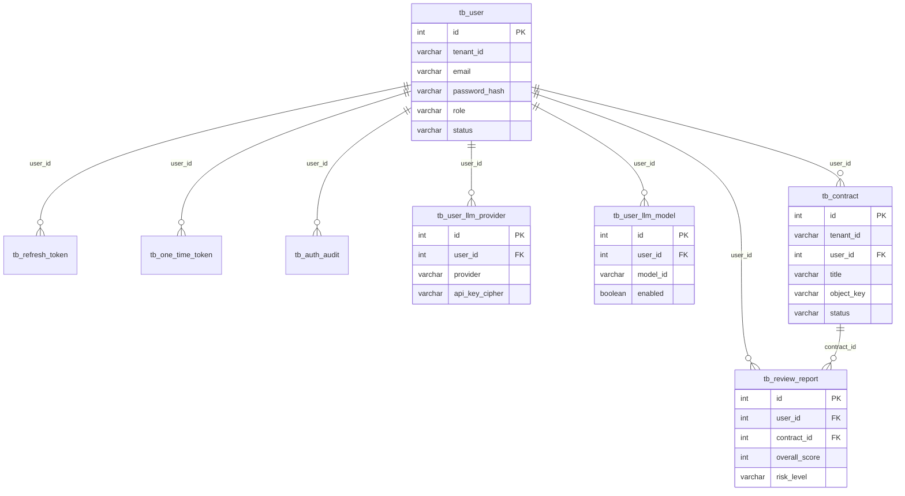

# 数据库表 DDL 与 ER 图

> **单一表结构目录。** ORM 在 `app/backend/models/`；本文件记录与 ORM `comment=` 一致的 DDL 及关系图。
> 运行时建表仍由启动 `create_all` + 幂等 `COMMENT ON` 完成（见 `services/schema_bootstrap.py`）。
>
> **强制**：任何 FEAT / BUG 只要新增、删除、重命名表或列、改约束/索引/注释，必须在同一次迭代更新本文件（变更记录 + DDL + ER）。`bash scripts/verify.sh --docs-only` 会检查本文件存在，且 `models/` 中每个 `__tablename__` 都出现在本文档。

## 变更记录

| 日期 | 迭代 | 变更 |
|------|------|------|
| 2026-08-28 | BUG-007 | `tb_contract.user_id` / `tb_review_report.user_id` 改为 integer，外键 `tb_user(id) ON DELETE CASCADE` |
| 2026-08-28 | FEAT-009 | 首次收录现行八张业务表（无结构变更，仅建目录） |

## ER 图



说明：用户 1:N 合同，合同 1:N 审查报告。合同与报告的 `user_id` 与 `tb_user.id` 同为 integer，外键 `ON DELETE CASCADE`。JWT `sub` 仅在令牌序列化时为字符串。

## 表 DDL

注释文案与 ORM `comment=` 保持一致。

### tb_user

```sql
CREATE TABLE IF NOT EXISTS tb_user (
    id integer GENERATED BY DEFAULT AS IDENTITY PRIMARY KEY,
    tenant_id varchar(64) NOT NULL DEFAULT 'default',
    email varchar(320) NOT NULL,
    password_hash varchar(255) NOT NULL,
    name varchar(120) NULL,
    role varchar(16) NOT NULL DEFAULT 'user',
    status varchar(32) NOT NULL DEFAULT 'pending_verification',
    failed_login_count integer NOT NULL DEFAULT 0,
    locked_until timestamptz NULL,
    last_login timestamptz NULL,
    created_at timestamptz NOT NULL DEFAULT now(),
    updated_at timestamptz NOT NULL DEFAULT now(),
    CONSTRAINT uq_tb_user_tenant_email UNIQUE (tenant_id, email),
    CONSTRAINT ck_tb_user_role CHECK (role IN ('user', 'admin')),
    CONSTRAINT ck_tb_user_status CHECK (status IN ('active', 'pending_verification', 'disabled')),
    CONSTRAINT ck_tb_user_failed_count CHECK (failed_login_count >= 0)
);
CREATE INDEX IF NOT EXISTS ix_tb_user_tenant_status ON tb_user (tenant_id, status);
COMMENT ON TABLE tb_user IS '自建认证账号表：邮箱密码用户，按租户隔离。';
COMMENT ON COLUMN tb_user.id IS '主键';
COMMENT ON COLUMN tb_user.tenant_id IS '租户标识';
COMMENT ON COLUMN tb_user.email IS '登录邮箱，小写存储';
COMMENT ON COLUMN tb_user.password_hash IS 'Argon2id 密码哈希';
COMMENT ON COLUMN tb_user.name IS '显示名';
COMMENT ON COLUMN tb_user.role IS '角色 user/admin';
COMMENT ON COLUMN tb_user.status IS '账号状态';
COMMENT ON COLUMN tb_user.failed_login_count IS '连续登录失败次数';
COMMENT ON COLUMN tb_user.locked_until IS '锁定截止时间';
COMMENT ON COLUMN tb_user.last_login IS '最近成功登录时间';
COMMENT ON COLUMN tb_user.created_at IS '创建时间';
COMMENT ON COLUMN tb_user.updated_at IS '更新时间';
```

### tb_refresh_token

```sql
CREATE TABLE IF NOT EXISTS tb_refresh_token (
    id integer GENERATED BY DEFAULT AS IDENTITY PRIMARY KEY,
    user_id integer NOT NULL REFERENCES tb_user(id) ON DELETE CASCADE,
    tenant_id varchar(64) NOT NULL DEFAULT 'default',
    family_id varchar(64) NOT NULL,
    token_hash varchar(64) NOT NULL,
    expires_at timestamptz NOT NULL,
    used_at timestamptz NULL,
    revoked_at timestamptz NULL,
    replaced_by_id integer NULL,
    created_at timestamptz NOT NULL DEFAULT now(),
    CONSTRAINT uq_tb_refresh_token_hash UNIQUE (token_hash)
);
CREATE INDEX IF NOT EXISTS ix_tb_refresh_token_family ON tb_refresh_token (family_id);
CREATE INDEX IF NOT EXISTS ix_tb_refresh_token_user ON tb_refresh_token (user_id);
COMMENT ON TABLE tb_refresh_token IS '刷新令牌表：只存哈希，用于轮换、重放检测与整族吊销。';
COMMENT ON COLUMN tb_refresh_token.id IS '主键';
COMMENT ON COLUMN tb_refresh_token.user_id IS '所属用户';
COMMENT ON COLUMN tb_refresh_token.tenant_id IS '租户标识';
COMMENT ON COLUMN tb_refresh_token.family_id IS '令牌族，用于整族吊销';
COMMENT ON COLUMN tb_refresh_token.token_hash IS '刷新令牌 SHA-256';
COMMENT ON COLUMN tb_refresh_token.expires_at IS '过期时间';
COMMENT ON COLUMN tb_refresh_token.used_at IS '轮换使用时间';
COMMENT ON COLUMN tb_refresh_token.revoked_at IS '吊销时间';
COMMENT ON COLUMN tb_refresh_token.replaced_by_id IS '后继令牌 id';
COMMENT ON COLUMN tb_refresh_token.created_at IS '创建时间';
```

### tb_one_time_token

```sql
CREATE TABLE IF NOT EXISTS tb_one_time_token (
    id integer GENERATED BY DEFAULT AS IDENTITY PRIMARY KEY,
    user_id integer NOT NULL REFERENCES tb_user(id) ON DELETE CASCADE,
    purpose varchar(32) NOT NULL,
    token_hash varchar(64) NOT NULL,
    expires_at timestamptz NOT NULL,
    consumed_at timestamptz NULL,
    created_at timestamptz NOT NULL DEFAULT now(),
    CONSTRAINT uq_tb_one_time_token_hash UNIQUE (token_hash),
    CONSTRAINT ck_tb_one_time_token_purpose CHECK (purpose IN ('email_verify', 'password_reset'))
);
CREATE INDEX IF NOT EXISTS ix_tb_one_time_token_user_purpose ON tb_one_time_token (user_id, purpose);
COMMENT ON TABLE tb_one_time_token IS '一次性令牌表：邮箱验证与密码重置，消费后不可再用。';
COMMENT ON COLUMN tb_one_time_token.id IS '主键';
COMMENT ON COLUMN tb_one_time_token.user_id IS '所属用户';
COMMENT ON COLUMN tb_one_time_token.purpose IS '用途 email_verify/password_reset';
COMMENT ON COLUMN tb_one_time_token.token_hash IS '令牌 SHA-256';
COMMENT ON COLUMN tb_one_time_token.expires_at IS '过期时间';
COMMENT ON COLUMN tb_one_time_token.consumed_at IS '消费时间';
COMMENT ON COLUMN tb_one_time_token.created_at IS '创建时间';
```

### tb_auth_audit

```sql
CREATE TABLE IF NOT EXISTS tb_auth_audit (
    id integer GENERATED BY DEFAULT AS IDENTITY PRIMARY KEY,
    tenant_id varchar(64) NOT NULL DEFAULT 'default',
    user_id integer NULL,
    event varchar(48) NOT NULL,
    outcome varchar(16) NOT NULL DEFAULT 'success',
    ip_hash varchar(64) NULL,
    detail text NULL,
    created_at timestamptz NOT NULL DEFAULT now()
);
CREATE INDEX IF NOT EXISTS ix_tb_auth_audit_user_time ON tb_auth_audit (user_id, created_at);
CREATE INDEX IF NOT EXISTS ix_tb_auth_audit_event_time ON tb_auth_audit (event, created_at);
COMMENT ON TABLE tb_auth_audit IS '认证审计表：只记事件与脱敏哈希，不存密码或令牌明文。';
COMMENT ON COLUMN tb_auth_audit.id IS '主键';
COMMENT ON COLUMN tb_auth_audit.tenant_id IS '租户标识';
COMMENT ON COLUMN tb_auth_audit.user_id IS '用户 id，失败登录可空';
COMMENT ON COLUMN tb_auth_audit.event IS '事件类型';
COMMENT ON COLUMN tb_auth_audit.outcome IS '结果';
COMMENT ON COLUMN tb_auth_audit.ip_hash IS '来源 IP 哈希';
COMMENT ON COLUMN tb_auth_audit.detail IS '脱敏说明';
COMMENT ON COLUMN tb_auth_audit.created_at IS '创建时间';
```

### tb_contract

```sql
CREATE TABLE IF NOT EXISTS tb_contract (
    id integer GENERATED BY DEFAULT AS IDENTITY PRIMARY KEY,
    tenant_id varchar(64) NOT NULL,
    user_id integer NOT NULL REFERENCES tb_user(id) ON DELETE CASCADE,
    title varchar(255) NOT NULL,
    file_name varchar(255) NOT NULL,
    bucket_name varchar(128) NOT NULL,
    object_key varchar(512) NOT NULL,
    file_size integer NULL,
    contract_type varchar(64) NULL,
    party_role varchar(32) NULL,
    status varchar(32) NOT NULL,
    error_message text NULL,
    created_at timestamptz NOT NULL,
    updated_at timestamptz NOT NULL,
    CONSTRAINT ck_tb_contract_status CHECK (status IN ('pending', 'reviewing', 'completed', 'failed'))
);
CREATE INDEX IF NOT EXISTS ix_tb_contract_owner_created ON tb_contract (tenant_id, user_id, created_at);
COMMENT ON TABLE tb_contract IS '合同表：只存元数据与对象键，不存文件正文或签名 URL。';
COMMENT ON COLUMN tb_contract.id IS '主键，自增';
COMMENT ON COLUMN tb_contract.tenant_id IS '租户标识，由令牌写入，不信任请求体';
COMMENT ON COLUMN tb_contract.user_id IS '归属用户主键，由令牌写入，不信任请求体';
COMMENT ON COLUMN tb_contract.title IS '合同标题，用户可见';
COMMENT ON COLUMN tb_contract.file_name IS '原始上传文件名';
COMMENT ON COLUMN tb_contract.bucket_name IS 'MinIO 桶名';
COMMENT ON COLUMN tb_contract.object_key IS '对象存储键，禁止存签名 URL';
COMMENT ON COLUMN tb_contract.file_size IS '文件字节数';
COMMENT ON COLUMN tb_contract.contract_type IS '用户声明的合同类型';
COMMENT ON COLUMN tb_contract.party_role IS '委托方立场，如甲方/乙方';
COMMENT ON COLUMN tb_contract.status IS '处理状态：pending/reviewing/completed/failed';
COMMENT ON COLUMN tb_contract.error_message IS '失败原因，成功时为空';
COMMENT ON COLUMN tb_contract.created_at IS '创建时间';
COMMENT ON COLUMN tb_contract.updated_at IS '更新时间';
```

### tb_review_report

```sql
CREATE TABLE IF NOT EXISTS tb_review_report (
    id integer GENERATED BY DEFAULT AS IDENTITY PRIMARY KEY,
    tenant_id varchar(64) NOT NULL,
    user_id integer NOT NULL REFERENCES tb_user(id) ON DELETE CASCADE,
    contract_id integer NOT NULL REFERENCES tb_contract(id) ON DELETE CASCADE,
    contract_title varchar(255) NOT NULL,
    contract_type varchar(64) NULL,
    overall_score integer NOT NULL,
    risk_level varchar(16) NOT NULL,
    summary text NOT NULL,
    high_risk_count integer NULL,
    medium_risk_count integer NULL,
    low_risk_count integer NULL,
    risk_clauses text NULL,
    missing_clauses text NULL,
    compliance_checks text NULL,
    key_terms text NULL,
    suggestions text NULL,
    raw_text_excerpt text NULL,
    created_at timestamptz NOT NULL,
    updated_at timestamptz NOT NULL,
    CONSTRAINT ck_tb_review_report_score CHECK (overall_score >= 0 AND overall_score <= 100),
    CONSTRAINT ck_tb_review_report_risk CHECK (risk_level IN ('high', 'medium', 'low'))
);
CREATE INDEX IF NOT EXISTS ix_tb_review_report_owner_created ON tb_review_report (tenant_id, user_id, created_at);
CREATE INDEX IF NOT EXISTS ix_tb_review_report_contract ON tb_review_report (tenant_id, user_id, contract_id);
COMMENT ON TABLE tb_review_report IS '审查报告表：评分与条款子结构，按租户+用户隔离。';
COMMENT ON COLUMN tb_review_report.id IS '主键，自增';
COMMENT ON COLUMN tb_review_report.tenant_id IS '租户标识，由令牌写入';
COMMENT ON COLUMN tb_review_report.user_id IS '归属用户主键，由令牌写入，不信任请求体';
COMMENT ON COLUMN tb_review_report.contract_id IS '关联合同主键，删除合同时级联删除报告';
COMMENT ON COLUMN tb_review_report.contract_title IS '合同标题快照，避免改名后报告标题漂移';
COMMENT ON COLUMN tb_review_report.contract_type IS '合同类型快照';
COMMENT ON COLUMN tb_review_report.overall_score IS '综合评分 0-100';
COMMENT ON COLUMN tb_review_report.risk_level IS '整体风险：high/medium/low';
COMMENT ON COLUMN tb_review_report.summary IS '报告摘要';
COMMENT ON COLUMN tb_review_report.high_risk_count IS '高风险条款条数';
COMMENT ON COLUMN tb_review_report.medium_risk_count IS '中风险条款条数';
COMMENT ON COLUMN tb_review_report.low_risk_count IS '低风险条款条数';
COMMENT ON COLUMN tb_review_report.risk_clauses IS '风险条款 JSON 字符串，只读展示';
COMMENT ON COLUMN tb_review_report.missing_clauses IS '缺失条款 JSON 字符串，只读展示';
COMMENT ON COLUMN tb_review_report.compliance_checks IS '合规检查 JSON 字符串，只读展示';
COMMENT ON COLUMN tb_review_report.key_terms IS '关键条款 JSON 字符串，只读展示';
COMMENT ON COLUMN tb_review_report.suggestions IS '建议 JSON 字符串，只读展示';
COMMENT ON COLUMN tb_review_report.raw_text_excerpt IS '原文摘录，仅长度受限摘要';
COMMENT ON COLUMN tb_review_report.created_at IS '创建时间';
COMMENT ON COLUMN tb_review_report.updated_at IS '更新时间';
```

### tb_user_llm_provider

```sql
CREATE TABLE IF NOT EXISTS tb_user_llm_provider (
    id integer GENERATED BY DEFAULT AS IDENTITY PRIMARY KEY,
    tenant_id varchar(64) NOT NULL,
    user_id integer NOT NULL REFERENCES tb_user(id) ON DELETE CASCADE,
    provider varchar(32) NOT NULL,
    api_key_cipher varchar(1024) NOT NULL,
    key_suffix varchar(8) NOT NULL DEFAULT '',
    created_at timestamptz NOT NULL DEFAULT now(),
    updated_at timestamptz NOT NULL DEFAULT now(),
    CONSTRAINT uq_tb_user_llm_provider UNIQUE (tenant_id, user_id, provider)
);
CREATE INDEX IF NOT EXISTS ix_tb_user_llm_provider_user ON tb_user_llm_provider (tenant_id, user_id);
COMMENT ON TABLE tb_user_llm_provider IS '用户 LLM 提供商凭据：只存加密 Key 与末四位掩码。';
COMMENT ON COLUMN tb_user_llm_provider.id IS '主键';
COMMENT ON COLUMN tb_user_llm_provider.tenant_id IS '租户标识';
COMMENT ON COLUMN tb_user_llm_provider.user_id IS '所属用户';
COMMENT ON COLUMN tb_user_llm_provider.provider IS '提供商 id，由注册表校验';
COMMENT ON COLUMN tb_user_llm_provider.api_key_cipher IS 'Fernet 加密后的 API Key';
COMMENT ON COLUMN tb_user_llm_provider.key_suffix IS 'Key 末四位，仅供回显';
COMMENT ON COLUMN tb_user_llm_provider.created_at IS '创建时间';
COMMENT ON COLUMN tb_user_llm_provider.updated_at IS '更新时间';
```

### tb_user_llm_model

```sql
CREATE TABLE IF NOT EXISTS tb_user_llm_model (
    id integer GENERATED BY DEFAULT AS IDENTITY PRIMARY KEY,
    tenant_id varchar(64) NOT NULL,
    user_id integer NOT NULL REFERENCES tb_user(id) ON DELETE CASCADE,
    provider varchar(32) NOT NULL,
    model_id varchar(191) NOT NULL,
    display_name varchar(191) NOT NULL DEFAULT '',
    enabled boolean NOT NULL DEFAULT false,
    created_at timestamptz NOT NULL DEFAULT now(),
    updated_at timestamptz NOT NULL DEFAULT now(),
    CONSTRAINT uq_tb_user_llm_model UNIQUE (tenant_id, user_id, provider, model_id)
);
CREATE INDEX IF NOT EXISTS ix_tb_user_llm_model_user ON tb_user_llm_model (tenant_id, user_id);
CREATE UNIQUE INDEX IF NOT EXISTS uq_tb_user_llm_model_enabled
    ON tb_user_llm_model (tenant_id, user_id) WHERE enabled = true;
COMMENT ON TABLE tb_user_llm_model IS '用户已选 LLM 模型：enabled 表示当前审查使用的那一个。';
COMMENT ON COLUMN tb_user_llm_model.id IS '主键';
COMMENT ON COLUMN tb_user_llm_model.tenant_id IS '租户标识';
COMMENT ON COLUMN tb_user_llm_model.user_id IS '所属用户';
COMMENT ON COLUMN tb_user_llm_model.provider IS '提供商 id';
COMMENT ON COLUMN tb_user_llm_model.model_id IS '提供商侧模型标识';
COMMENT ON COLUMN tb_user_llm_model.display_name IS '展示名';
COMMENT ON COLUMN tb_user_llm_model.enabled IS '是否为当前审查模型';
COMMENT ON COLUMN tb_user_llm_model.created_at IS '创建时间';
COMMENT ON COLUMN tb_user_llm_model.updated_at IS '更新时间';
```
